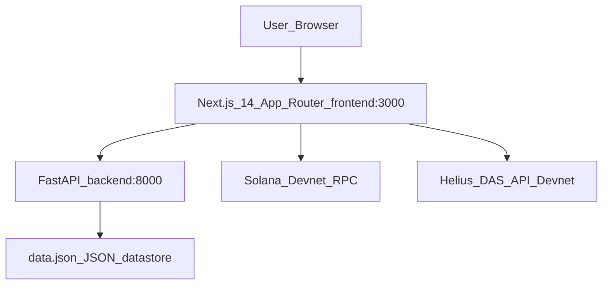

# Homenet — Handover Document (for next AI agent)

## Project summary (2 sentences)
Homenet is a hackathon demo for **real-world asset (RWA) tokenization on Solana Devnet**, with a modern **Next.js 14 App Router** dashboard. It uses a **Python FastAPI** backend running locally on `:8000` to serve property data, while the frontend mints Metaplex Core assets and simulates “instant liquidity” via a Sell flow.

---

## Current architecture (high level)



- **Backend** serves property data and user creation from a local JSON store (`data.json`).
- **Frontend** fetches properties from backend, provides wallet connect (Solana), mints assets with Metaplex Core/Umi, shows a live “Trading Terminal” that polls Helius DAS and renders both logs + a TVL chart.
- **Sell flow** is a demo-only liquidation simulation using wallet message signing and a toast.

---

## Tech stack

### Backend (Python)
- **FastAPI** (`main.py`)
- **Uvicorn**
- **Pydantic v2**
- **python-dotenv** (optional usage; backend code tolerates missing module)
- **Local persistence**: JSON file store (`data.json`) via `database.py`
  - Uses `asyncio.to_thread` for file IO so async endpoints don’t block the event loop.

### Frontend (Web)
- **Next.js 14 (App Router)**
- **React 18**
- **Tailwind CSS**
- **Lucide React** (icons)
- **Sonner** (toasts)
- **Recharts** (line chart in terminal)

### Solana / Web3
- **Solana Devnet**
- Solana Wallet Adapter:
  - `@solana/wallet-adapter-react`
  - `@solana/wallet-adapter-react-ui`
  - `@solana/wallet-adapter-wallets` (currently Phantom adapter)
  - `@solana/web3.js`
- Metaplex Core minting:
  - `@metaplex-foundation/mpl-core` (`create(...)`)
  - `@metaplex-foundation/umi-bundle-defaults` (`createUmi(...)`)
  - `@metaplex-foundation/umi-signer-wallet-adapters` (`walletAdapterIdentity(...)`)
  - `@metaplex-foundation/umi` (`generateSigner(...)`)

### External API
- **Helius Devnet DAS API** (polling via JSON-RPC `getAssetsByAuthority`)

---

## What was successfully implemented

### 1) Backend: MongoDB removed → JSON datastore
- MongoDB/Motor was removed. Backend is now demo-stable and runs locally with `data.json`.
- `seed.py` generates demo properties with ObjectId-like 24-hex IDs.
- API endpoints:
  - `GET /properties`
  - `GET /properties/{property_id}` (24-hex validation)
  - `POST /users`
- There is also a simple HTML page at backend `/` (not essential once the frontend exists).

### 2) Frontend: Solana pivot + Metaplex Core minting
- Thirdweb/EVM setup was removed.
- Solana providers are set up in:
  - `frontend/src/components/solana-provider.tsx`
  - Wrapped in `frontend/src/app/layout.tsx`
  - Wallet UI styles imported in layout: `@solana/wallet-adapter-react-ui/styles.css`
- Navbar uses Solana `WalletMultiButton` and was made SSR-safe via `dynamic(..., { ssr:false })` to fix hydration mismatch.

### 3) PropertyCard UX + rules-of-hooks stabilization
- `frontend/src/components/property-card.tsx`:
  - Fixed “Rendered more hooks than during the previous render” by keeping all hooks at the top.
  - Card layout fixed to ensure equal heights + aligned buttons:
    - outer card: `flex flex-col h-full`
    - top section: `flex-grow`
    - bottom section: `mt-auto`

### 4) Sell / liquidity simulation flow
- `PropertyCard` includes local ownership state:
  - `const [isOwned, setIsOwned] = useState(false);`
- After a successful mint, `setIsOwned(true)` and button switches from **Invest** → **Sell Position**.
- Sell simulation:
  - Calls `wallet.signMessage(new TextEncoder().encode('Liquidate Homenet Asset: ' + property.address))`
  - Shows toast “Asset Liquidated. USDC transferred to wallet.”
  - Sets `setIsOwned(false)` to revert to Invest.

### 5) RWA Terminal (text logs + chart) + event plumbing
- `frontend/src/components/rwa-terminal.tsx`:
  - Retro Mac header + black container.
  - Split view:
    - Top ~60%: Recharts LineChart (TVL trace) with neon-green line glow.
    - Bottom ~40%: green CRT glowing logs (`text-green-400 drop-shadow-[0_0_8px_rgba(74,222,128,0.8)]`).
  - Auto-scroll with a ref when logs update.
  - Polls every 10s to Helius DAS `getAssetsByAuthority`.
  - Dedupes asset IDs using a `useRef(new Set())` so logs don’t spam.
  - Heartbeat logs every 3s to keep terminal “active.”
  - Listens for custom liquidation event:
    - `window.dispatchEvent(new CustomEvent("homenet:rwa-liquidation", { detail: { address, time } }))`
    - Terminal logs: `🔴 LIQUIDATION EXECUTED: <address> position closed.`

### 6) Environment / secret hygiene
Goal: remove hardcoded RPC/API URLs before publishing.

- Root-level env files added:
  - `/.env.local` (contains real values; **ignored by git**)
  - `/.env.example` (placeholder values for judges)
- `.gitignore` updated to include `.env.local`.
- Frontend now uses environment variables:
  - `NEXT_PUBLIC_HELIUS_RPC_URL`
  - `NEXT_PUBLIC_PYTHON_BACKEND_URL`
- Hardcoded URLs removed from:
  - `frontend/src/components/solana-provider.tsx` (endpoint)
  - `frontend/src/components/rwa-terminal.tsx` (Helius poll URL)
  - `frontend/src/lib/api.ts` (backend base URL)
  - `frontend/src/app/page.tsx` (error display URL)

---

## UI / Tailwind styling rules & conventions

- **Overall theme**: dark, high-tech hacker aesthetic.
  - Page shell uses: `bg-[#070707] text-white`
  - Navbar: `border-b border-white/10 bg-black/40 backdrop-blur` (sticky)
- **Property cards**:
  - Container style: `rounded-2xl border border-white/10 bg-white/[0.06] p-4 shadow-sm backdrop-blur`
  - Layout: `flex flex-col h-full` with `flex-grow` top and `mt-auto` bottom.
- **Buttons**:
  - Invest: white button (high contrast): `bg-white text-black rounded-xl ...`
  - Sell Position: red destructive CTA: `bg-red-600 hover:bg-red-700 text-white rounded-xl ...`
- **Terminal CRT glow**:
  - Must be green with glow:
    - `text-green-400 drop-shadow-[0_0_8px_rgba(74,222,128,0.8)]`
- **Recharts chart**:
  - Minimal grid: faint `stroke="#333"` with low opacity
  - Neon line: `stroke="#4ade80" strokeWidth={2}` + CSS drop-shadow glow
  - Axis lines hidden: `axisLine={false} tickLine={false}`

---

## Critical run commands (local)

### Backend
```bash
python -m venv venv
source venv/bin/activate
pip install -r requirements.txt
python seed.py
uvicorn main:app --host 0.0.0.0 --port 8000
```

### Frontend
```bash
cd frontend
npm install
npm run dev
```

---

## Known gotchas
- **Phantom network**: user must switch wallet to **Devnet** and have Devnet SOL; otherwise mint simulation can fail.
- **WalletMultiButton hydration**: must remain client-only (`dynamic(..., { ssr:false })`) to avoid hydration mismatch.
- **Helius key leakage**: ensure real URL is only in `.env.local` and not committed; `.env.example` is safe.

---

## Files to look at first

### Backend
- `main.py`, `database.py`, `seed.py`

### Frontend
- `frontend/src/app/layout.tsx`, `frontend/src/app/page.tsx`
- `frontend/src/components/solana-provider.tsx`
- `frontend/src/components/navbar.tsx`
- `frontend/src/components/property-card.tsx`
- `frontend/src/components/rwa-terminal.tsx`
- `frontend/src/lib/api.ts`

